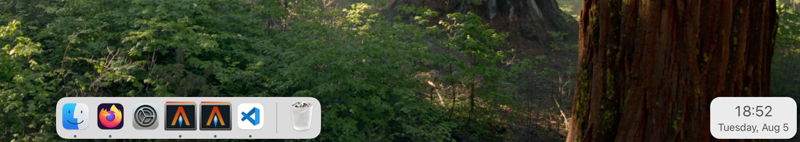

# Bare-bones floating clock for macOS

My setup has auto-hide for menu bar and dock, so I use this clock to show the
current time in the bottom right corner.

Screenshot:

Forked and slightly reworked from https://github.com/kolbusa/FloatClock.

## Build instructions

Requires Swift

Build: `make all`

Clean: `make clean`

Install: `sudo make install`

Add to login items: `make register`

Remove from login items: `make unregister`

Uninstall: `make uninstall`
